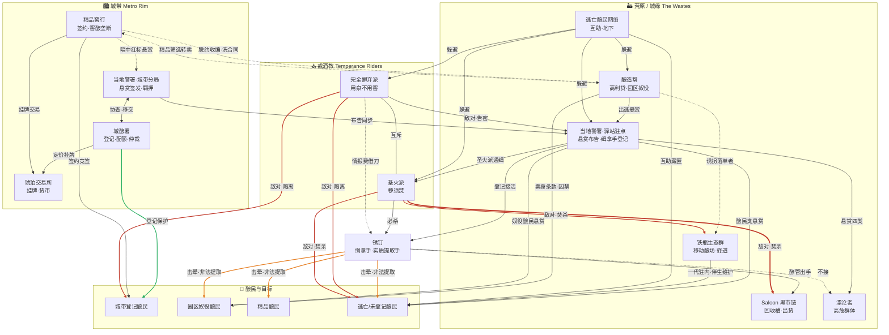
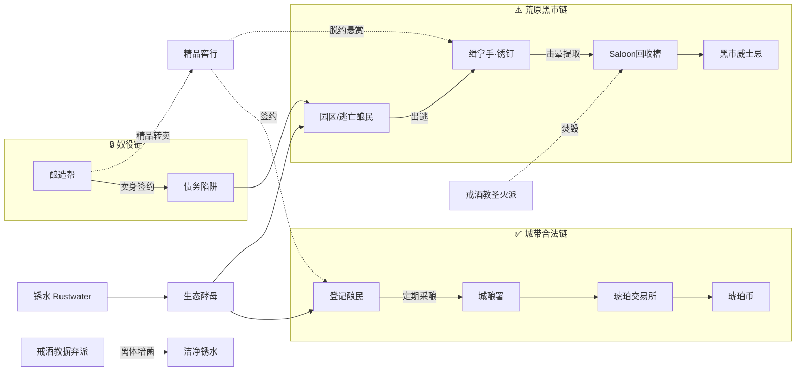
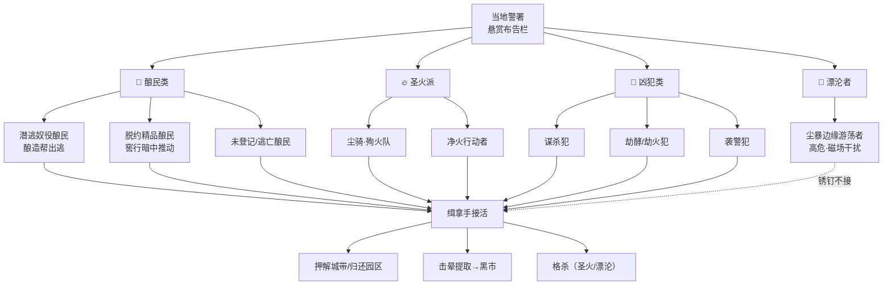
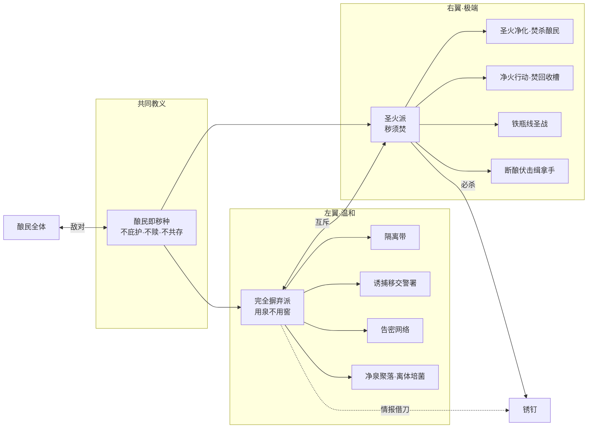

# 《瓶与源》势力网状图

**版本：`2026-07-20-v18`** · 垦历 C.Y. 42 · 十三月 Undecimber · 叙事范围：赭锈带 only

> 配套设定：[worldbuilding-tree.md](./worldbuilding-tree.md)

---

## 一、势力总览

### 1.1 城带（Metro Rim）— 合法秩序层

| 势力 | 英文 | 核心职能 | 关键利益 |
|------|------|----------|----------|
| **城酿署** | Metro Brew Registry | 酿民登记 · 采酿配额 · 纠纷仲裁 | 维持登记秩序 · 合法采酿税收 |
| **琥珀交易所** | Amber Exchange | 威士忌分级挂牌 · 货币结算 | 定价权 · 流通垄断 |
| **精品窖行** | Vintage Vault Houses | 竞签精品酿民 · 窖酿拍卖 | 窖酿品质垄断 · 脱约者回收 |
| **当地警署（城带分局）** | Constabulary Post | 悬赏签发 · 羁押凶犯 · 协查酿民案 | 治安 · 悬赏接办费 |

### 1.2 荒原 / 城缘（The Wastes）— 黑市与生存层

| 势力 | 英文 | 核心职能 | 关键利益 |
|------|------|----------|----------|
| **当地警署（驿站驻点）** | Outpost Constabulary | 悬赏布告 · 登记缉拿手 | 荒原治安名义 · 实际纵容黑市提取 |
| **酿造帮** | Brewing Syndicate | 高利贷 · 卖身条款 · 园区奴役酿造 | 债奴劳动力 · 出逃威慑悬赏 |
| **铁瓶生态群** | Synth-Rig Ecology | 移动酿场 · 驿道行驶 · 地表改造 | 一代驻内发酵 · 伴生二代维护 |
| **Saloon 黑市链** | Saloon Black Market | 回收槽收酵 · 威士忌出货 | 不问来路 · 酵管流通 |
| **戒酒教·完全摒弃派** | Total Rejection | 用泉不用窖 · 净泉聚落 | 离体培菌去毒锈水 · 摒弃酿民 |
| **戒酒教·圣火派** | Sacred Fire | 秽须焚 · 尘骑圣战 | 焚杀酿民与发酵基础设施 |
| **逃亡酿民网络** | Fugitive Brewfolk | 未登记者互助 · 地下逃生 | 躲避警署/酿造帮/戒酒教 |
| **漂沦者** | The Wander | 尘暴边缘游荡 | 生存（非组织） |

### 1.3 个体锚点（非组织）

| 角色 | 名义 | 实质 |
|------|------|------|
| **锈钉 Rust Nail** | 当地警署登记缉拿手 | 接悬赏 → 击晕酿民 → 非法提取 → Saloon 黑市出手 |
| **禁忌** | — | 不接漂沦者悬赏（生物磁场干扰提取器） |

### 1.4 存在体（被争夺 / 被保护对象）

| 类型 | 状态 | 主要遭遇 |
|------|------|----------|
| **城带登记酿民** | 城酿署保护 · 合法采酿 | 精品窖行签约 · 与荒原无关 |
| **酿造帮园区酿民** | 卖身条款 · 债务奴役 | 出逃 → 警署「潜逃奴役酿民」悬赏 |
| **精品酿民** | 窖酿级 · 高价值 | 窖行签约 / 脱约悬赏 / 黑市提取 |
| **铁瓶伴生酿民** | 未觉醒二代 · 随群落 | 维护铁瓶 · 偶有被酿造帮诱拐 |
| **逃亡 / 未登记酿民** | 无保护 | 警署悬赏 · 缉拿手提取 · 戒酒教敌对 |
| **漂沦者** | 首批畸变人类 | 警署高危悬赏 · 锈钉不接 |

---

## 二、关系类型图例

| 线型 / 颜色语义 | 含义 |
|----------------|------|
| 实线箭头 | 直接控制 / 指挥 / 利益输送 |
| 虚线箭头 | 暗中操作 / 容忍 / 借刀 |
| 双向箭头 | 交易 / 共存 / 对峙共存 |
| 红色 | 敌对 / 猎杀 / 焚杀 |
| 绿色 | 保护 / 合法共存 |
| 橙色 | 经济剥削 / 黑市 |

---

## 三、主网状关系图（势力全图）

---

## 四、经济流网状图（威士忌产业链）

---

## 五、警署悬赏靶网（四类目标）

---

## 六、戒酒教分裂网

---

## 七、冲突轴速查

| 冲突轴 | A 端 | B 端 | 锈钉位置 |
|--------|------|------|----------|
| **合法 vs 奴役** | 城酿署登记共存 | 酿造帮园区债奴 | 只接荒原悬赏，不进城 |
| **提取 vs 焚杀** | 缉拿手击晕复提取 | 圣火派净火灭种 | 提取方 · 圣火派必杀他 |
| **借刀 vs 亲自动手** | 摒弃派告密交警署 | 圣火派亲自焚杀 | 摒弃派可买情报 |
| **城带价 vs 黑市价** | 琥珀交易所挂牌 | Saloon 回收槽出手 | 窖七开篇刺破此缝 |
| **铁瓶通行 vs 抵制** | 生态群驿道命脉 | 摒弃派抵制 · 圣火派焚舱 | 中立通行 |

---

## 八、节点度数（关系密度）

| 势力 | 连接数 | 角色定位 |
|------|--------|----------|
| **当地警署** | 9+ | **枢纽** — 悬赏、协查、缉拿、纵容黑市 |
| **酿造帮** | 6 | **剥削源** — 奴役、出逃、悬赏、窖行灰市 |
| **锈钉** | 7 | **执行端** — 悬赏接活 + 黑市提取双轨 |
| **精品窖行** | 5 | **幕后推手** — 合法签约 + 暗中悬赏/收编 |
| **戒酒教** | 6（两派合计） | **意识形态敌对** — 酿民之敌 |
| **铁瓶生态群** | 4 | **基础设施** — 移动酿场 · 被圣火派 targeting |
| **Saloon黑市** | 3 | **出货终端** — 酵管变现 |
| **城酿署** | 4 | **秩序锚点** — 仅城带有效 |

---

## 九、派系态度矩阵（行 → 列）

> **完整 17×17 大表**（覆盖全部组织派系 + 酿民群体 + 个体锚点）：  
> → **[faction-attitude-matrix.md](./faction-attitude-matrix.md)**  
> → CSV：[faction-attitude-matrix.csv](./faction-attitude-matrix.csv)  
> → Excel：`瓶与井世界观树状图.xlsx` 工作表「派系态度矩阵」

### 覆盖派系（17）

| 类型 | 派系 |
|------|------|
| **城带组织（4）** | 城酿署 · 琥珀交易所 · 精品窖行 · 当地警署 |
| **荒原组织（7）** | 酿造帮 · 铁瓶生态群 · Saloon黑市链 · 戒酒教·摒弃派 · 戒酒教·圣火派 · 逃亡酿民网络 · 漂沦者 |
| **个体（1）** | 锈钉 |
| **酿民群体（5）** | 城带登记酿民 · 园区奴役酿民 · 精品酿民 · 铁瓶伴生酿民 · 逃亡/未登记酿民 |

### 态度图例

| 标记 | 含义 |
|------|------|
| **合作 / 依赖 / 交易** | 制度协作或业务往来 |
| **监管 / 容忍 / 利用** | 规制、放任或单方面借力 |
| **疏远 / 无视 / 防备** | 少接触或警惕 |
| **抵制 / 追捕 / 敌对** | 拒绝合作或主动打击 |
| **焚杀 / 必杀** | 以消灭为目标 |
| **被追捕 / 被敌对 / 被提取** | 被动承受方态度 |
| **躲避 / 互助 / 庇护** | 逃离或同阵营互助 |
| **—** | 自身 / 不适用 |

### 预览（组织派系 12×12 子表）

完整 17×17 见 [faction-attitude-matrix.md](./faction-attitude-matrix.md)。

| 行＼列 | 城酿署 | 琥珀交易所 | 精品窖行 | 当地警署 | 酿造帮 | 铁瓶生态群 | Saloon黑市 | 摒弃派 | 圣火派 | 逃亡网络 | 漂沦者 | 锈钉 |
|--------|--------|------------|----------|----------|--------|------------|------------|--------|--------|----------|--------|------|
| **城酿署** | — | 合作 | 监管容忍 | 合作 | 疏远 | 疏远 | 追捕 | 利用 | 敌对 | 追捕 | 追捕 | 无视 |
| **琥珀交易所** | 依赖 | — | 交易 | 无视 | 无视 | 无视 | 敌对 | 无视 | 防备 | 无视 | 无视 | 无视 |
| **精品窖行** | 依赖 | 交易 | — | 利用 | 利用 | 无视 | 利用 | 无视 | 防备 | 追捕 | 无视 | 利用 |
| **当地警署** | 合作 | 无视 | 容忍 | — | 合作 | 容忍 | 容忍 | 利用 | 追捕 | 追捕 | 追捕 | 利用 |
| **酿造帮** | 躲避 | 无视 | 交易 | 利用 | — | 利用 | 交易 | 利用 | 敌对 | 追捕 | 躲避 | 利用 |
| **铁瓶生态群** | 疏远 | 无视 | 无视 | 疏远 | 防备 | — | 交易 | 被抵制 | 被敌对 | 庇护 | 无视 | 容忍 |
| **Saloon黑市** | 躲避 | 敌对 | 交易 | 应付 | 交易 | 交易 | — | 被抵制 | 被敌对 | 容忍 | 躲避 | 交易 |
| **摒弃派** | 利用 | 抵制 | 敌对 | 利用 | 利用 | 抵制 | 抵制 | — | 敌对 | 敌对 | 无视 | 利用 |
| **圣火派** | 敌对 | 敌对 | 敌对 | 敌对 | 敌对 | 焚杀 | 焚杀 | 敌对 | — | 焚杀 | 无视 | 必杀 |
| **逃亡网络** | 躲避 | 无视 | 躲避 | 躲避 | 躲避 | 求助 | 利用 | 躲避 | 躲避 | 互助 | 躲避 | 躲避 |
| **漂沦者** | 被追捕 | 无关 | 无关 | 被追捕 | 无关 | 无关 | 回避 | 无关 | 无关 | 无关 | — | 被悬赏 |
| **锈钉** | 无视 | 无视 | 无视 | 依赖 | 利用 | 利用 | 依赖 | 疏远 | 躲避 | 无关 | 禁忌 | — |

---

*生成自 `scripts/faction_attitude_matrix.py` v18 · 更新势力设定时请同步数据文件*
